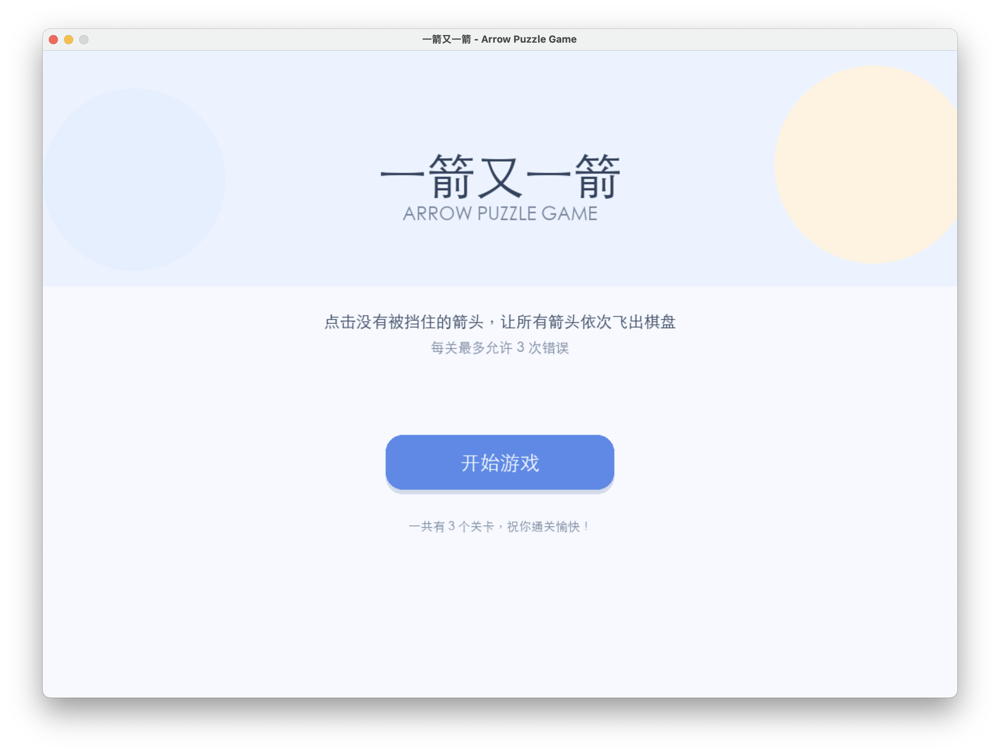
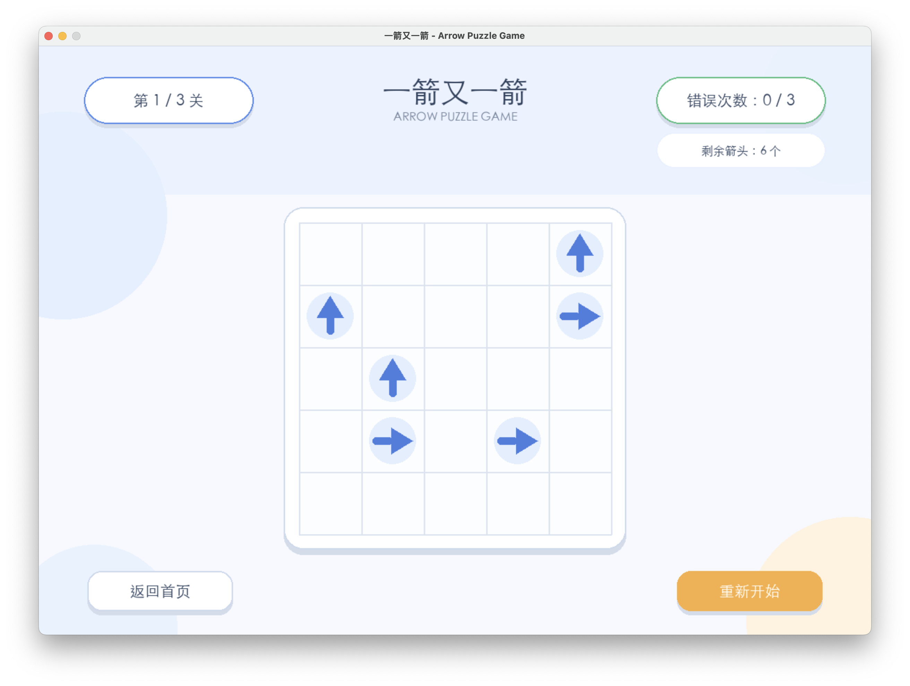
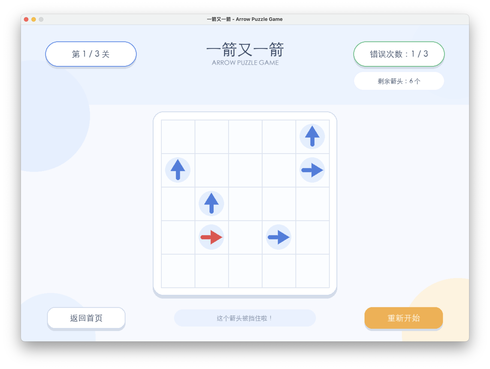
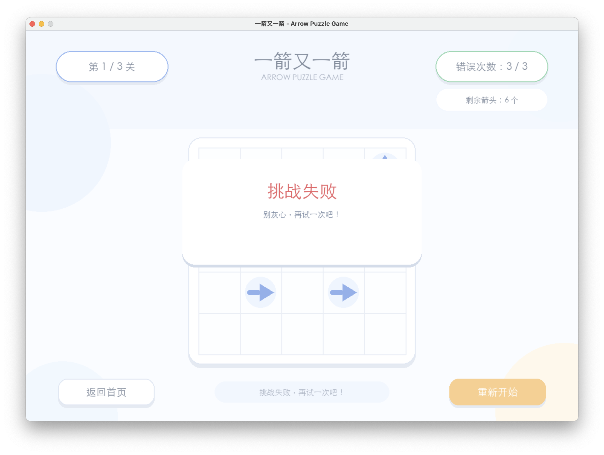
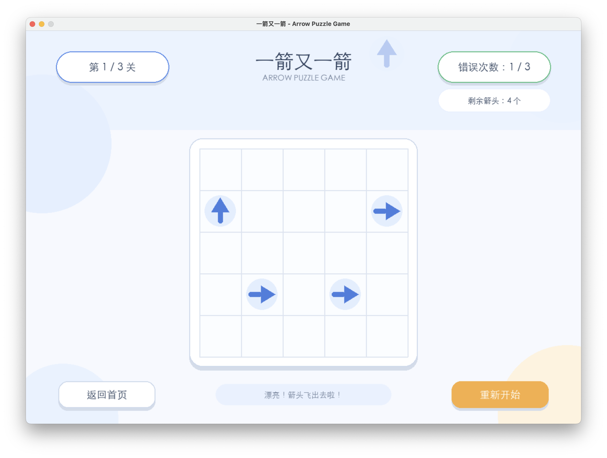
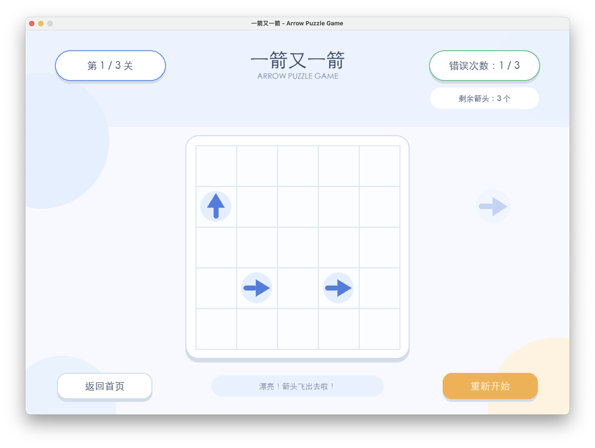
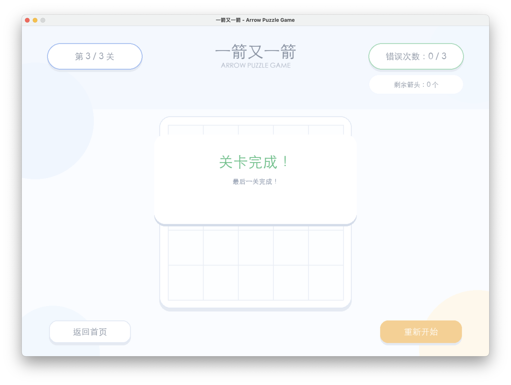

# 一箭又一箭 - Arrow Puzzle Game

## 1. 项目简介

《一箭又一箭》是一款基于 Python + Pygame 开发的轻量级箭头解谜小游戏。

玩家需要观察棋盘中每个箭头的方向，点击当前没有被其他箭头阻挡的箭头，使其沿自身指向飞出棋盘。

如果箭头的飞行路径上存在其他箭头，则当前箭头无法飞出，并会产生碰撞反馈，同时消耗一次错误机会。

游戏共设计 3 个关卡，每个关卡均经过可解性检查，保证存在至少一种通关方案。

---

## 2. 游戏特点

- 四方向箭头解谜
- 箭头沿自身方向飞出
- 箭头被阻挡时无法移动
- 被阻挡的箭头会显示红色反馈
- 错误操作会消耗错误次数
- 每关最多允许 3 次错误
- 3 个可正常完成的关卡
- 关卡完成后自动进入下一关
- 全部关卡完成后显示通关界面
- 错误次数耗尽后显示失败界面
- 支持重新开始当前游戏
- 支持返回首页
- 带有背景音乐
- 程序启动时自动检查关卡是否存在通关方案

---

## 3. 开发环境

### 软件环境

- Python 3.12
- Pygame 2.6.1
- macOS

### Python 依赖

项目依赖位于 requirements.txt 文件中。

文件内容：

pygame

---

## 4. 安装与运行

### 4.1 创建虚拟环境

进入项目目录：

cd Arrow_Puzzle_Game

创建 Python 虚拟环境：

python3.12 -m venv venv

激活虚拟环境：

source venv/bin/activate

### 4.2 安装依赖

pip install -r requirements.txt

### 4.3 运行游戏

python main.py

程序启动后会自动进行关卡可解性检查。

正常情况下会输出：

========== 关卡可解性检查 ==========
第 1 关：√ 存在通关方式
第 2 关：√ 存在通关方式
第 3 关：√ 存在通关方式
==================================

---

## 5. 游戏操作

### 开始游戏

在首页点击“开始游戏”，进入第一关。

### 点击箭头

鼠标点击棋盘中的箭头：

- 如果箭头前方没有其他箭头，则箭头沿自身方向飞出棋盘。
- 如果箭头前方存在其他箭头，则箭头无法移动。
- 被阻挡的箭头会显示红色反馈。
- 同时错误次数增加。

### 重新开始

点击右下角“重新开始”，可以重新开始当前游戏。

### 返回首页

点击左下角“返回首页”，可以回到游戏首页。

---

## 6. 游戏流程

开始界面
↓
开始游戏
↓
第 1 关
↓
完成第 1 关
↓
第 2 关
↓
完成第 2 关
↓
第 3 关
↓
完成第 3 关
↓
通关界面

如果某一关错误次数达到上限：

游戏进行中
↓
错误次数达到 3 次
↓
挑战失败
↓
重新开始

---

## 7. 核心实现

### 7.1 箭头阻挡判断

程序根据箭头当前所在的行、列以及箭头方向判断其飞行路径上是否存在其他箭头。

只有路径上没有其他箭头时，箭头才能飞出棋盘。

### 7.2 箭头飞行动画

箭头成功点击后，不会直接消失，而是按照箭头自身的方向进行移动动画。

上箭头 ↑ 会向上方飞出棋盘。

右箭头 → 会向右方飞出棋盘。

下箭头 ↓ 会向下方飞出棋盘。

左箭头 ← 会向左方飞出棋盘。

### 7.3 碰撞反馈

当玩家点击被其他箭头阻挡的箭头时：

1. 箭头不会移动；
2. 箭头显示红色；
3. 错误次数增加；
4. 游戏界面显示提示信息。

### 7.4 关卡可解性检查

为了避免出现无法完成的关卡，程序启动时会对关卡进行搜索。

程序模拟不同的箭头点击顺序，判断是否能够最终移除全部箭头。

只有存在完整解决方案的关卡才会通过检查。

本项目目前设计了 3 个关卡，运行时均能够通过可解性检查。

---

## 8. 项目结构

Arrow_Puzzle_Game/
├── main.py
├── requirements.txt
├── README.md
├── .gitignore
├── assets/
│   └── background_music.wav
└── screenshots/
    ├── 01_start.png
    ├── 02_level1.png
    ├── 03_fail.png
    ├── 04_blocked_red.png
    ├── 05_level3_success.png
    ├── 06_arrow_fly.png
    └── 07_arrow_fly2.png

其中：

- main.py：游戏主要源代码
- requirements.txt：Python 依赖
- README.md：项目说明文档
- .gitignore：Git 忽略文件配置
- assets/background_music.wav：游戏背景音乐
- screenshots/：游戏运行截图
- venv/：本地 Python 虚拟环境，不上传 GitHub

---

## 9. 游戏截图

### 9.1 开始界面

### 9.2 游戏主界面

### 9.3 被阻挡的箭头

### 9.4 游戏失败

### 9.5 箭头飞出

### 9.6 箭头飞出后的棋盘状态

### 9.7 最后一关完成

---

## 10. 测试情况

| 测试编号 | 测试内容 | 预期结果 | 测试结果 |
|---|---|---|---|
| T01 | 点击未被阻挡的箭头 | 箭头沿自身方向飞出并消失 | 通过 |
| T02 | 点击被阻挡的箭头 | 箭头保持原位，错误次数增加 | 通过 |
| T03 | 点击位于边缘且方向朝外的箭头 | 箭头正常消失，不发生越界错误 | 通过 |
| T04 | 清除当前关卡全部箭头 | 显示完成效果并进入下一关 | 通过 |
| T05 | 错误次数达到 3 次 | 显示挑战失败界面 | 通过 |
| T06 | 游戏过程中点击重新开始 | 当前关卡布局和错误次数恢复初始状态 | 通过 |

---

## 11. AIGC 辅助开发

本项目在开发过程中使用 AIGC / Coding Agent 辅助完成部分程序设计、代码编写、问题定位和功能优化。

主要使用场景包括：

1. 根据游戏需求设计 Pygame 游戏整体结构；
2. 实现箭头点击、阻挡判断和飞行动画；
3. 修复箭头没有按照自身方向飞出的问题；
4. 增加关卡可解性检查；
5. 增加被阻挡箭头的红色碰撞反馈；
6. 协助排查运行过程中的 Python / Pygame 问题。

AIGC 生成的代码经过人工运行、测试和修改后用于最终项目。

---

## 12. 项目运行效果

游戏具有开始界面、游戏界面、失败界面和通关界面。

玩家通过合理安排箭头点击顺序，逐步清空棋盘中的所有箭头。

项目共设置 3 个关卡，并对关卡进行可解性验证。

---

## 13. 作者

课程：软件工程与软件工程实践

作者：卢志勇

项目名称：一箭又一箭

开发语言：Python

游戏框架：Pygame
